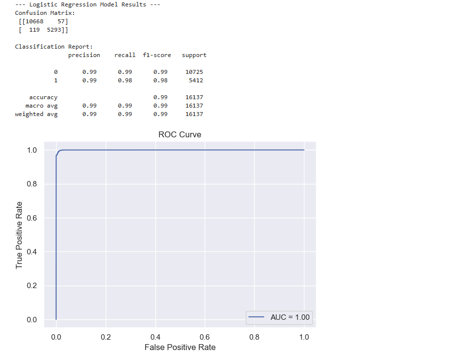

# P-Card Transaction Risk Modeling and Anomaly Detection

## Project Overview
This project analyzes corporate purchase card (P-Card) transactions to identify high-risk cardholder behavior and uncover anomalies in meal-related spending. It combines business rules (per diem thresholds) with machine learning (logistic regression & isolation forest) to surface potential compliance issues across departments.

---

## Objective
- Flag employees regularly exceeding meal per diem thresholds
- Build predictive models to identify cardholders likely to overspend
- Detect transaction anomalies using unsupervised machine learning
- Create executive-friendly summaries by month and department

---

## Tools & Techniques
- Python (Pandas, scikit-learn, Matplotlib, Seaborn)
- Logistic Regression (predictive modeling)
- Isolation Forest (anomaly detection)
- Business rule logic (threshold flagging)
- Data wrangling, aggregation, and time-based groupings

---

## Files Included
- `pcard_risk_analysis.ipynb` : Full analysis and model code
- `data/`: Sample CSVs to test the code
  - `dummy_pcard_transactions.csv`
  - `dummy_pcardholder_limits.csv`
  - `dummy_employee_list.csv`
- `images/`: Output visualizations
  - `meal_anomaly_distribution.PNG`
  - `log_regression_results.PNG`
 
---

## How to Run
1. Clone or download this repository
2. Open the `pcard_meals_analysis.ipynb` notebook
3. Ensure the dummy CSVs are placed in a `/data` folder relative to the notebook
4. Run the notebook cells to:
    - Clean the data
    - Generate per diem violation summaries
    - Train a logistic regression model
    - Visualize anomalies

---

## Sample Output
- Logistic regression results

- Anomaly distribution plot

## Results & Impact
- Identified ~$3.7M in annual overspending risk
- Prioritized 2.5% of transactions for targeted audit review
- Supported executive proposal for compliance policy updates
- Reduced manual audit load using data-driven flags

---

## Full Process

### 1. Data Preparation
- Processed ~1.6M transactions across 8 years
- Cleaned and standardized merchant names, transaction flags (weekend, round-dollar, etc.)
- Merged employee metadata and cost center details

### 2. Feature Engineering
- Created flags for weekend spending, refund transactions, round-dollar values
- Derived time-based features (e.g., day of week, month, year)
- Calculated merchant category risk groupings

### 3. Predictive Modeling
- Built logistic regression and decision tree classifiers to predict overspending risk
- Evaluated models using ROC-AUC, precision-recall curves, and cross-validation

### 4. Anomaly Detection
- Used Isolation Forest and statistical outlier detection to flag abnormal transactions
- Visualized top 1% anomalies by risk score for audit review

