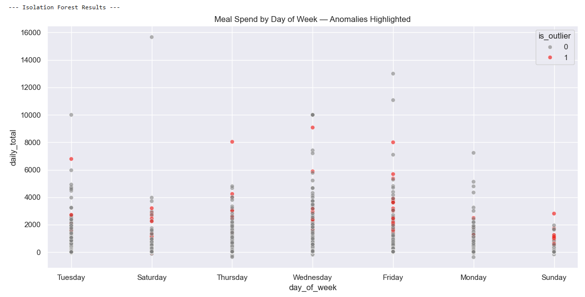

# P-Card Transaction Risk Modeling and Anomaly Detection

## Project Overview
This project used predictive modeling and anomaly detection to identify high-risk transactions in a corporate purchasing card (P-Card) dataset spanning eight years. The goal was to support internal audit efforts, reduce overspending, and strengthen compliance visibility.

---

## Objective
- Detect overspending and high-risk cardholder behavior
- Prioritize audit reviews based on transaction risk scores
- Support compliance policy changes using data-backed insights

---

## Tools & Techniques
- **Languages**: Python (Pandas, NumPy, scikit-learn, Matplotlib, Seaborn)
- **Database**: PostgreSQL
- **Visualization**: SAP Analytics Cloud, Qlik Sense
- **Methods**: Logistic Regression, Decision Trees, Isolation Forest, Feature Engineering, Outlier Detection

---

## Process

### 1. Data Preparation
- Processed ~1.6M transactions across 8 years
- Cleaned and standardized merchant names, transaction flags (weekend, round-dollar, etc.)
- Merged employee metadata and cost center details

### 2. Feature Engineering
- Created flags for weekend spending, refund transactions, round-dollar values
- Derived time-based features (e.g., day of week, month, year)
- Calculated merchant category risk groupings

### 3. Predictive Modeling
- Built logistic regression and decision tree classifiers to predict overspending risk
- Evaluated models using ROC-AUC, precision-recall curves, and cross-validation

### 4. Anomaly Detection
- Used Isolation Forest and statistical outlier detection to flag abnormal transactions
- Visualized top 1% anomalies by risk score for audit review

---

## Results & Impact
- Identified ~$3.7M in annual overspending risk
- Prioritized 2.5% of transactions for targeted audit review
- Supported executive proposal for compliance policy updates
- Reduced manual audit load using data-driven flags

## Sample Visualizations
- Anomaly distribution plot


---

## Related Skills Demonstrated
- Predictive modeling
- Anomaly detection
- ETL pipeline design
- Business analytics storytelling
- Compliance and risk strategy

---

## Repository Structure

```bash
pcard-risk-modeling/
│
├── README.md
├── notebooks/
│   └── risk_model.ipynb
├── data/
│   └── sample_data.csv
├── images/
│   └── meal_anomaly_distribution.png


